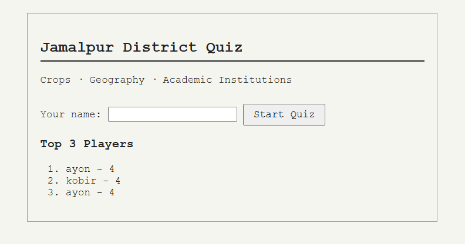

# District Quiz Game - Servlet Project

A Java Servlet web app that quizzes users on the district 'Jamalpur' of Bangladesh, backed by a MySQL database.

- Questions are stored in and fetched from the database.
- Player name and score are saved after each try.
- A leaderboard that displays past scores, ranked.

**Tech stack:** Java Servlets, MySQL, JDBC.
